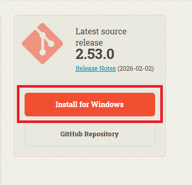

# Curso: Dominando Git y la Conexión con la Nube


<div style="page-break-before:always"></div>

## Introducción

Bienvenido al curso. Antes de empezar a trabajar con Git, necesitas tenerlo instalado en tu máquina. En este vídeo vemos cómo hacerlo en **Windows**, paso a paso.

## Descargando Git

Abre el navegador y ve a la página oficial de Git:

[Instalar Git](https://git-scm.com/)

Ahí verás un botón de descarga que ya detecta automáticamente que estás en Windows. Haz clic y descarga el instalador.



## Instalando Git

Ejecuta el instalador que acabas de descargar. Te va a hacer varias preguntas durante el proceso. **Mi recomendación**: deja todas las opciones por defecto y pulsa _Next_ hasta el final. No necesitas cambiar nada.

## Verificando la instalación

Una vez terminada la instalación, abre una terminal. Puedes usar **Git Bash**, que viene incluido con Git, o el **Símbolo del sistema**. Escribe:

```bash
git --version
```

Si te devuelve un número de versión, perfecto. Git está instalado y listo.

```bash
git version 2.53.0.windows.1
```

Con esto ya tienes Git en tu máquina Windows. En el siguiente vídeo configuramos Git con tu nombre y tu correo para que queden registrados en cada cambio que hagas.

Nos vemos ahí.

---
