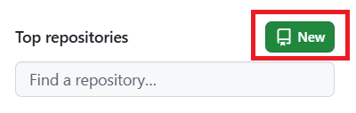
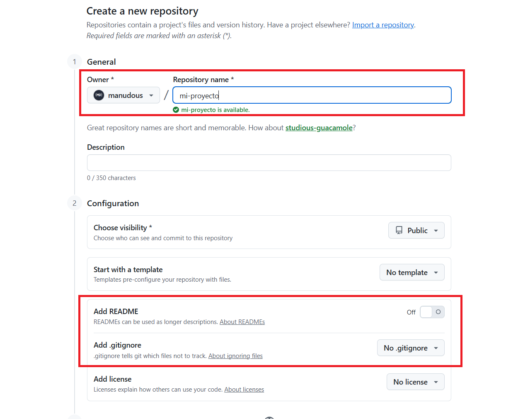
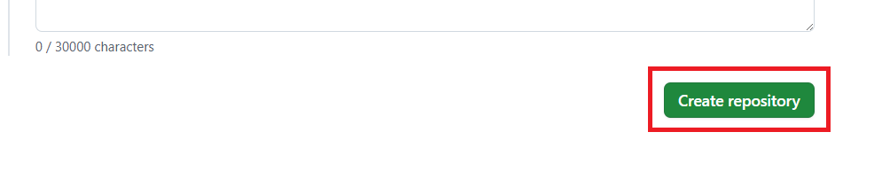
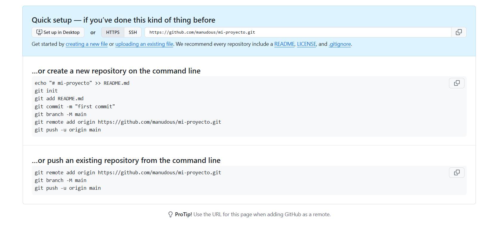

# Curso: Dominando Git y la Conexión con la Nube


<div style="page-break-before:always"></div>

## Introducción

Ya tienes Git instalado y configurado. Ahora toca lo interesante: crear tu primer repositorio. Vamos a hacerlo en dos pasos: primero en tu máquina, en local, y luego lo conectamos con GitHub para tener una copia en la nube.

## Creando el proyecto en local

Primero nos creamos una carpeta para nuestro proyecto y nos metemos en ella:

```bash
mkdir mi-proyecto
cd mi-proyecto
```

Ahora iniciamos el repositorio Git:

```bash
git init
```


Con esto Git crea la carpeta oculta `.git` dentro del proyecto, que es donde vive toda la base de datos del repositorio: commits, ramas, configuración...

## Añadiendo los primeros ficheros

Nuestro proyecto de ejemplo va a tener dos ficheros: un `index.html` y un `index.js`.

_**index.html**_

```html
<!DOCTYPE html>
<html lang="es">
  <head>
    <meta charset="UTF-8" />
    <title>Mi proyecto</title>
  </head>
  <body>
    <script src="index.js"></script>
  </body>
</html>
```

_**index.js**_

```js
console.log("Hola mundo");
```

## Primer commit

Vemos el estado del repositorio antes de añadir nada:

```bash
git status
```

Git nos indica que hay ficheros sin seguimiento (_untracked_).

```bash
On branch main

No commits yet

Untracked files:
  (use "git add <file>..." to include in what will be committed)
        index.html
        index.js

nothing added to commit but untracked files present (use "git add" to track)
```

Los añadimos al área de staging:

```bash
git add .
```

Y hacemos el primer commit:

```bash
git commit -m "primer commit"
```

Ya tenemos un repositorio local con su primer commit.

```bash
[main (root-commit) 2dda805] primer commit
 2 files changed, 11 insertions(+)
 create mode 100644 index.html
 create mode 100644 index.js
```

## Creando el repositorio en GitHub

Ahora queremos tener una copia del repositorio en GitHub para poder sincronizar los cambios desde cualquier máquina.

Entramos en [github.com](https://github.com), iniciamos sesión y creamos un repositorio nuevo.



- Nombre del repositorio: `mi-proyecto` (o el que prefieras).
- Lo dejamos **vacío**: sin README, sin `.gitignore`, sin licencia. Así evitamos conflictos al sincronizarlo con nuestro repo local.



Creamos el repositorio.



Una vez creado, GitHub nos muestra la URL del repositorio. La necesitaremos en el siguiente paso para vincular nuestro repositorio local con el remoto.



---

Ya tenemos el repositorio en local y en GitHub. Lo que nos falta es conectarlos. En los siguientes vídeos veremos cómo autenticarnos usando HTTP con token o SSH, y cómo subir los cambios.

Nos vemos ahí.

---
