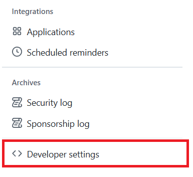
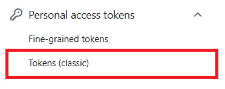
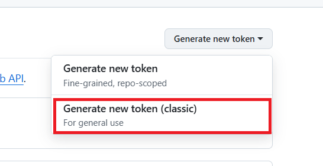
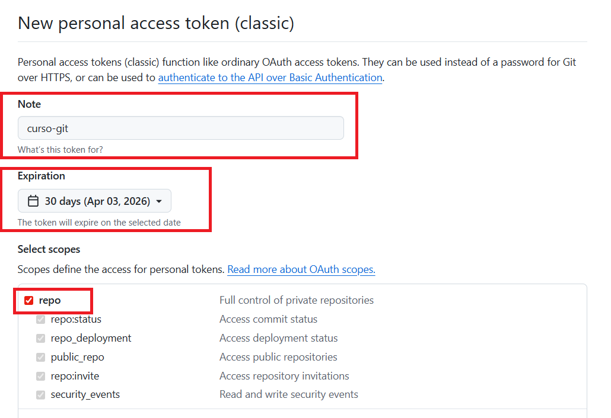
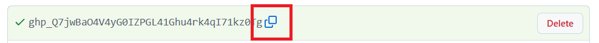
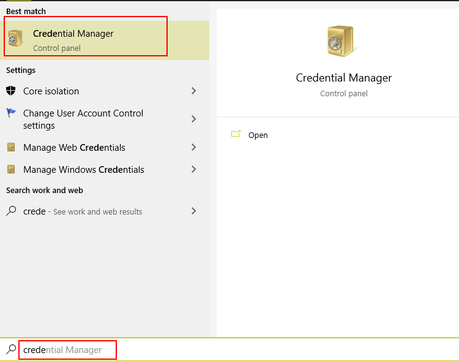
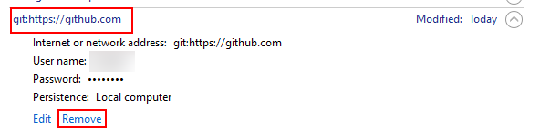
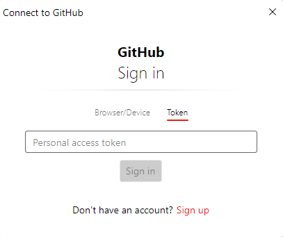

# Setup HTTP: Personal Access Token (PAT)


<div style="page-break-before:always"></div>

Las contraseñas de cuenta quedaron bloqueadas en 2021. La alternativa más sencilla por HTTPS son los **Personal Access Tokens (PAT)**: contraseñas técnicas generadas por GitHub con permisos y caducidad controlados.

## ¿Qué ventajas tiene un token frente a una contraseña?

- **Scope limitado:** puedes darle permisos solo para repositorios, sin acceso al resto de tu cuenta.
- **Caducidad:** se puede configurar para que expire automáticamente.
- **Revocable:** si se compromete, lo borras y generas uno nuevo sin tocar tu contraseña.

## Generando el token en GitHub

### 1. Accede a la configuración de tu cuenta

Entra en [github.com](https://github.com), haz clic en tu avatar (arriba a la derecha) y selecciona **Settings**.


### 2. Developer settings

Baja hasta el final del menú lateral izquierdo y haz clic en **Developer settings**.



### 3. Personal access tokens

En el menú izquierdo selecciona **Personal access tokens** > **Tokens (classic)**.



### 4. Genera un token nuevo

Haz clic en **Generate new token** > **Generate new token (classic)**.



### 5. Configura el token

Rellena los campos:

- **Note:** un nombre descriptivo, por ejemplo `curso-git`.
- **Expiration:** el tiempo que quieres que dure. Para el curso puedes poner 30 días.
- **Scopes:** marca **`repo`** (da acceso completo a repositorios públicos y privados).



### 6. Copia el token

Haz clic en **Generate token**. GitHub te mostrará el token **una sola vez**. Cópialo ahora porque no volverás a verlo.



¡Vamos a probarlo!, antes de nada, asegúrate que borramos todos los credenciales que tenemos configurardos para GiHub. En Windows, abre el "Administrador de credenciales" y borra cualquier entrada relacionada con GitHub. En Mac, abre "Acceso a Llaveros" y haz lo mismo.



Y elimina cualquier entrada relacionada con GitHub.



## Usando el token para hacer push

Partimos del repositorio local `mi-proyecto` que ya tiene el remote configurado. Si no lo tienes aún, añádelo:

```bash
git remote add origin https://github.com/tu-usuario/mi-proyecto.git
```

Ahora hacemos push. Git nos pedirá credenciales:

```bash
git push origin main
```

Ahora se nos abrirá un diálogo para introducir nuestro token:



Lo introducimos el token que hemos generado antes y hacemos click en "Sign in". Si el token es correcto, GitHub nos permitirá hacer push y veremos el mensaje de éxito en la terminal:

```bash
Enumerating objects: 5, done.
Counting objects: 100% (5/5), done.
Delta compression using up to 16 threads
Compressing objects: 100% (3/3), done.
Writing objects: 100% (3/3), 289 bytes | 289.00 KiB/s, done.
Total 3 (delta 1), reused 0 (delta 0), pack-reused 0 (from 0)
remote: Resolving deltas: 100% (1/1), completed with 1 local object.
To https://github.com/manudous/mi-proyecto.git
   871fcff..7013a5f  main -> main
```
