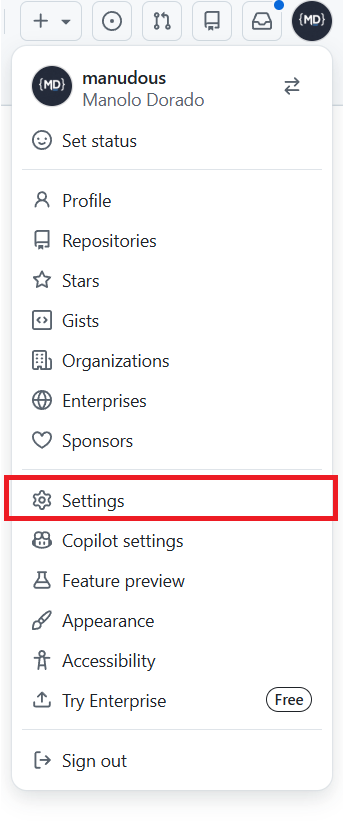
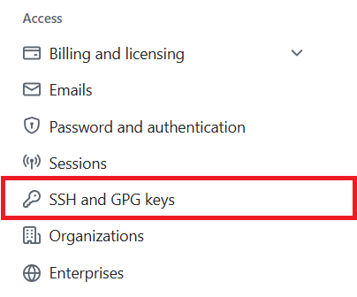
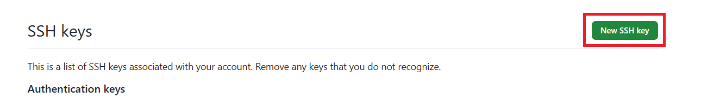
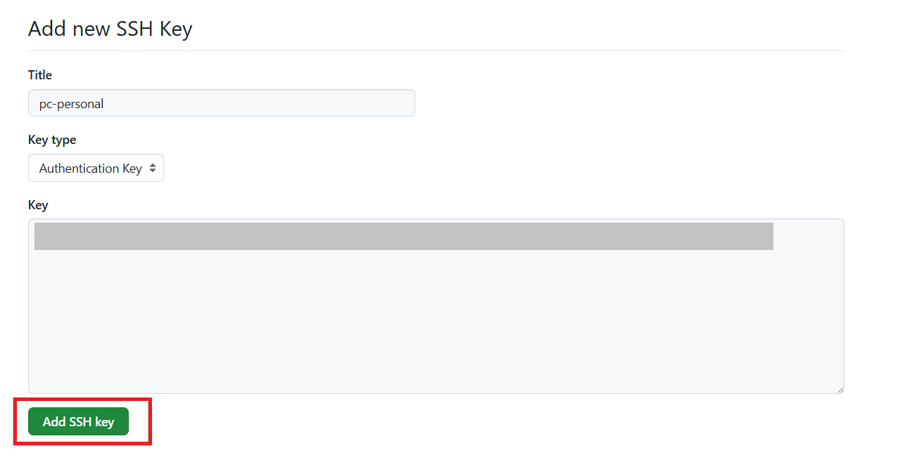
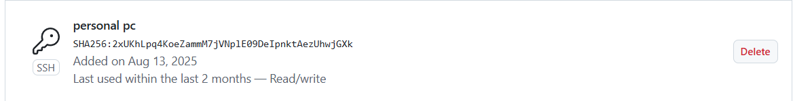

# Setup SSH: Seguridad profesional


<div style="page-break-before:always"></div>

SSH es el método preferido en equipos profesionales. En lugar de enviar una contraseña o token por la red, se usa **criptografía asimétrica**: demuestras que tienes la llave privada sin revelarla nunca.

## ¿Cómo funciona?

Se generan dos ficheros vinculados matemáticamente:

- **Llave privada** (`id_ed25519`): se queda en tu máquina. Nunca la compartas.
- **Llave pública** (`id_ed25519.pub`): se sube a GitHub. Es el candado que solo tu llave abre.

Cuando haces un `push`, SSH demuestra criptográficamente que tienes la llave privada correspondiente al candado registrado en GitHub. Sin contraseñas, sin tokens, sin que nada secreto viaje por la red.

## Generando las llaves SSH

### 1. Comprueba si ya tienes llaves

Antes de generar, mira si ya tienes un par de llaves:

```bash
ls ~/.ssh
```

Si ves ficheros `id_ed25519` e `id_ed25519.pub` ya las tienes y puedes saltar al paso 4. Si la carpeta no existe o está vacía, continúa.

### 2. Genera el par de llaves

Usamos el algoritmo **Ed25519**, más moderno y seguro que RSA:

```bash
ssh-keygen -t ed25519 -C "tu-email@ejemplo.com"
```

El comando te hará tres preguntas:

- **Ruta donde guardar la llave:** pulsa Enter para aceptar la ruta por defecto (`~/.ssh/id_ed25519`).
- **Passphrase:** una contraseña opcional para proteger la llave privada. Puedes dejarla vacía pulsando Enter dos veces.

### 3. Arranca el agente SSH y añade la llave

El agente SSH es un proceso que gestiona tus llaves en memoria para no tener que reintroducir la passphrase en cada operación:

```bash
eval "$(ssh-agent -s)"
ssh-add ~/.ssh/id_ed25519
```

```
Agent pid 12345
Identity added: /home/usuario/.ssh/id_ed25519 (tu-email@ejemplo)
```

## Añadiendo la llave pública a GitHub

### 4. Copia la llave pública

```bash
cat ~/.ssh/id_ed25519.pub
```

Copia todo el texto que aparece (empieza por `ssh-ed25519` y termina con tu email).

### 5. Accede a la configuración de tu cuenta

Entra en [github.com](https://github.com), haz clic en tu avatar y selecciona **Settings**.



### 6. SSH and GPG keys

En el menú lateral izquierdo haz clic en **SSH and GPG keys**.



### 7. Nueva SSH key

Haz clic en **New SSH key**.



### 8. Añade la llave

Rellena los campos:

- **Title:** un nombre descriptivo, por ejemplo `pc-personal`.
- **Key type:** `Authentication Key` (valor por defecto).
- **Key:** pega aquí el contenido de `id_ed25519.pub` que copiaste antes.

Haz clic en **Add SSH key**.



GitHub te confirma que la llave se ha añadido correctamente.



## Verificando la conexión

Comprueba que todo funciona antes de hacer el primer push:

```bash
ssh -T git@github.com
```

Si es la primera vez, SSH te preguntará si confías en el host de GitHub. Escribe `yes` y pulsa Enter.

La respuesta correcta es:

```bash
Hi tu-usuario! You've successfully authenticated, but GitHub does not provide shell access.
```

## Haciendo push por SSH

Hay que cambiar la URL del remote para que use SSH en lugar de HTTPS. Si ya tenías el remote configurado con HTTPS:

```bash
git remote set-url origin git@github.com:tu-usuario/mi-proyecto.git
```

Si aún no tienes el remote:

```bash
git remote add origin git@github.com:tu-usuario/mi-proyecto.git
```

Ahora el push ya no pedirá credenciales:

```bash
git push origin main
```

```bash
Enumerating objects: 5, done.
Counting objects: 100% (5/5), done.
Delta compression using up to 16 threads
Compressing objects: 100% (3/3), done.
Writing objects: 100% (3/3), 288 bytes | 288.00 KiB/s, done.
Total 3 (delta 1), reused 0 (delta 0), pack-reused 0 (from 0)
remote: Resolving deltas: 100% (1/1), completed with 1 local object.
To github.com:manudous/mi-proyecto.git
   7013a5f..acdb4f7  main -> main
```
